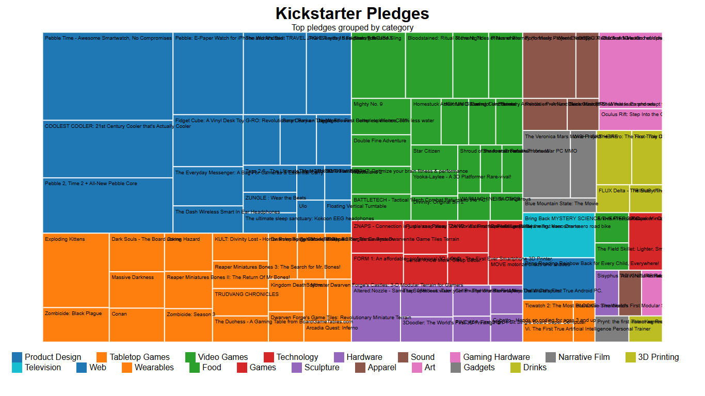

# Treemap Diagram with D3.js

This project is a data visualization of Kickstarter funding data using a **Treemap Diagram** built with D3.js. Each tile represents a specific project, with size proportional to the funding amount and color indicating its category.

## 🔍 Features

- Interactive treemap representing project funding values
- Tooltips showing project name, category, and value on hover
- Color-coded categories using D3's `schemeCategory10`
- Responsive layout with labels on each tile
- Legend displaying category color keys

## 📊 Dataset Source

Kickstarter funding data from FreeCodeCamp:
[Kickstarter Funding Data JSON](https://cdn.freecodecamp.org/testable-projects-fcc/data/tree_map/kickstarter-funding-data.json)

## 🛠️ Technologies Used

- D3.js (v7)
- HTML/CSS
- JavaScript (ES6)

## 💡 How It Works

- The data is processed into a hierarchical format using `d3.hierarchy`.
- `d3.treemap` computes the layout based on project values.
- Each tile is rendered as a `rect`, and color is assigned based on project category.
- Tooltips dynamically show detailed info on mouseover.
- A legend is generated to match colors to categories.

## 📷 Preview

## 🔗 Live Demo

[Click here to view the live project](https://tapubormon.github.io/bar-chart-d3/)

